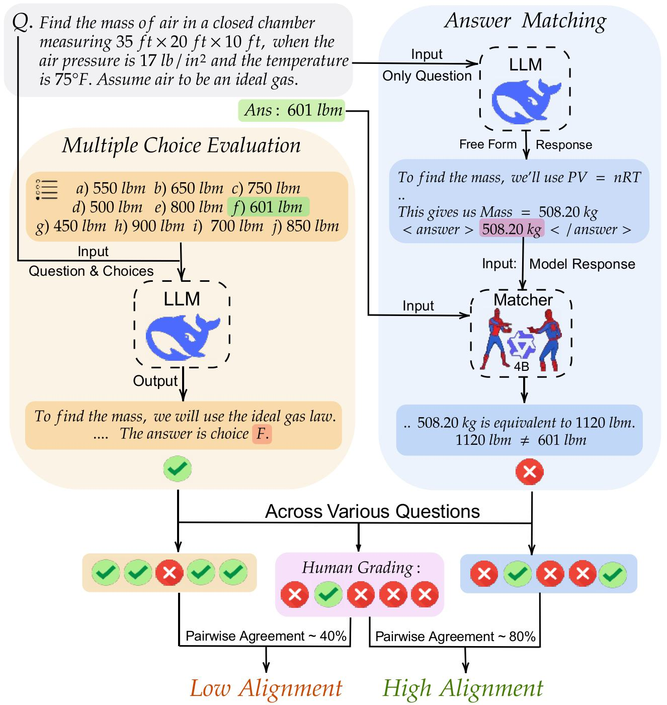

# Answer Matching Outperforms Multiple Choice for Language Model Evaluation

---

## 📊 What is Answer Matching? (Illustration)

<div align="center">
  
  <br/>
  <em>Models cannot solve the question but can guess the correct answer choice. Thus, MCQs don't measure the true generative performance of language models which we fix via answer matching and show it has high alignment with human grading.</em>
</div>

---

**This repository contains the codebase and resources for the paper:**

> **Answer Matching Outperforms Multiple Choice for Language Model Evaluation**

This work argues for evaluating large language models (LLMs) using *free-form answer matching* instead of traditional multiple-choice (MCQ) formats. We provide code, datasets, and tools for reproducing our experiments, training classifiers, and analyzing results across a variety of benchmarks.

---

## 🚀 Quickstart: Installation & Environment

This repo uses [`uv`](https://github.com/astral-sh/uv) as a fast, modern Python package manager. To get started:

```bash
# Install uv if you don't have it
pip install uv

# Create and activate a virtual environment
uv venv qa
source qa/bin/activate

# Install PyTorch (CUDA 12.1)
uv pip install torch --index-url https://download.pytorch.org/whl/cu121

# Install all dependencies for lmeval (API, wandb, vllm, dev extras)
cd lmeval
uv pip install -e ".[api,wandb,vllm,dev]"
```


---

## 📂 Directory Overview

- `mcq_classifier/`: Code to train a classifier on <b>choices-only data</b> from MCQ benchmarks (e.g., MMLU Pro, SuperGQPA, YourBench, TruthfulQA, HellaSwag, ARC) using HuggingFace Transformers and Accelerate. Includes both language and vision MCQ scripts. See its README for details.

- `src/query_models/`: Scripts for querying various language models with different question types (free-form, MCQ) and extracting their responses. Supports datasets like GPQA and MMLU-Pro.

- `src/filtering/`: Tools for filtering and combining QA datasets, including scripts for cleaning, merging, and scoring questions and answers.

- `src/cost_analysis/`: Tools for analyzing computational costs and token usage across different evaluation methods, including cost breakdowns and visualizations.

- `src/judge_w_gt/`: Framework for evaluating model responses using LLMs as matchers or judges, supporting both ground-truth (with reference answer) and free-form (without reference answer) judging for various question types.

- `src/visualize_resps/`: Flask-based annotation interface for labeling model responses; used for human annotation and navigation of QA data.

---

## 📚 Datasets, Annotations, and Model Outputs

We provide all free-form datasets, human annotations, and sample-level model outputs evaluated in our paper as a HuggingFace collection:

- [Answer Matching Collection on HuggingFace](https://huggingface.co/collections/nikhilchandak/answer-matching-6866a99934c2a9e625cde219)

This collection includes:
- Free-form QA datasets (e.g., GPQA Diamond, MMLU-Pro)
- Human annotation files
- Model outputs under different evaluation schemes (free-form, MCQ, etc.)

---

## 🤝 Get Involved

If you use these resources, please cite our paper. For questions or contributions, open an issue or pull request!


